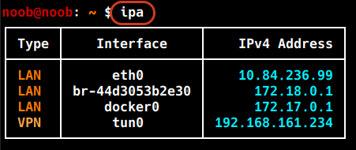
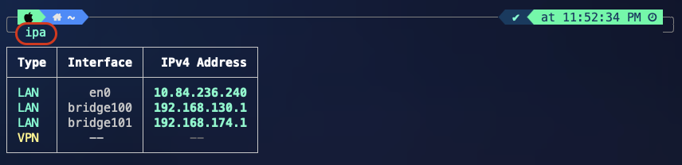

# Screenshots

## Kali Linux

### Default view

**Command**

```bash
ipa
```



Baseline output: LAN interfaces and Docker bridges correctly classified, VPN row shown as a placeholder since no VPN was connected in this capture.

---

## macOS

### Default view

**Command**

```bash
ipa
```


