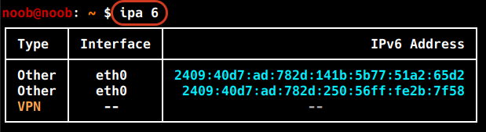
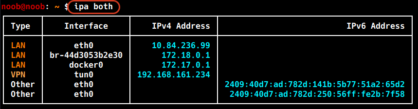
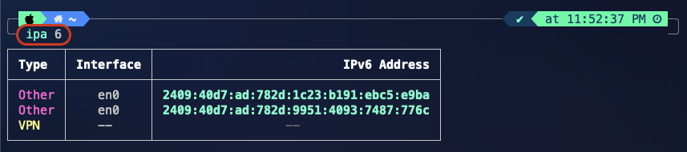
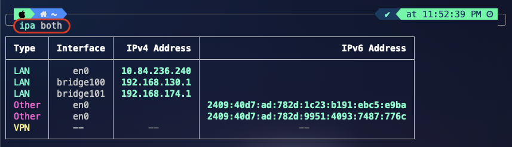

# Screenshots

## Kali Linux

### Default view

**Command**

```bash
ipa
```


Baseline output: LAN interfaces and Docker bridges correctly classified, VPN row shown as a placeholder since no VPN was connected in this capture.

---

### IPv6 and combined view

**Command**

```bash
ipa 6
```



```bash
ipa both
```



Shows the column layout adapting: `ipa 6` alone collapses to a placeholder row when no IPv6 address is present anywhere, while `ipa both` adds the IPv6 column without breaking table alignment.

---

## macOS

### Default view

**Command**

```bash
ipa
```

### IPv6 and combined view

**Command**

```bash
ipa 6
ipa both
```





Same script, same output shape, running on macOS via `iproute2mac` — with real global IPv6 addresses present on `en0`, correctly classified as `Other` (not misclassified as `LAN`), confirming the ULA-prefix check doesn't false-positive on public IPv6 ranges.
